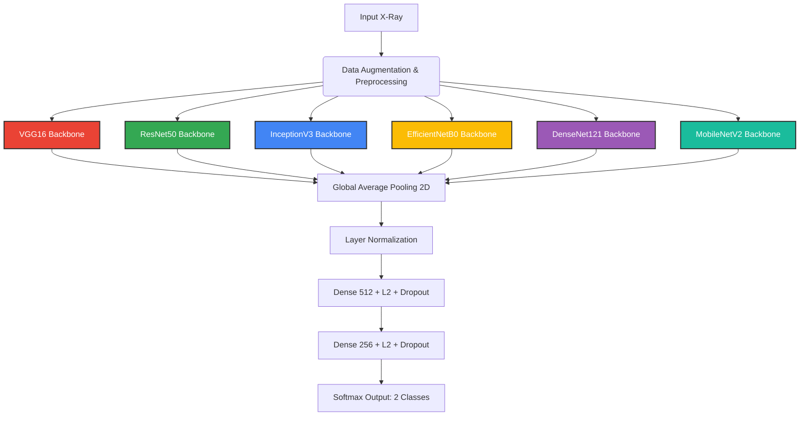

# Comparative Study of CNN Architectures for Pneumonia Detection
## Technical Reference and Architectural Vision Guide

This document provides a line-by-line, section-by-section analysis of the automated deep learning diagnostic system implemented in [pneumonia_fixed.ipynb](file:///d:/pneumonia/pneumonia_fixed.ipynb). It details what the code does, why it was added, and explains the key technical terms. Furthermore, it details the 6 Convolutional Neural Network (CNN) architectures used, their origin, their primary innovations, and their clinical applications.

---

## 1. Complete Section-by-Section Code Breakdown

### Section 0 · Kaggle Dataset Setup
* **Code Block:**
  ```python
  import kagglehub
  import os

  print("Downloading Kaggle Dataset...")
  dataset_path = kagglehub.dataset_download("paultimothymooney/chest-xray-pneumonia")
  print(f"Dataset cached at: {dataset_path}")

  _ROOT = os.path.join(dataset_path, "chest_xray")
  if not os.path.exists(os.path.join(_ROOT, "train", "NORMAL")):
      _ROOT = os.path.join(dataset_path, "chest_xray", "chest_xray")

  print(f"Verified Root Path: {_ROOT}")
  ```
* **What it does:** Programmatically calls the Kaggle API via `kagglehub` to search, download, and extract the `"paultimothymooney/chest-xray-pneumonia"` dataset, storing it in a local cache directory. It then defines `_ROOT` and verifies the exact path of the training folders, automatically correcting for double nesting (`chest_xray/chest_xray`) if present.
* **Why it is added:** It automates the data acquisition process. In cloud environments like Google Colab or Kaggle Kernels, it downloads the dataset directly from Kaggle servers to the runtime disk, eliminating the need to manually download, upload, or configure Kaggle API keys (`kaggle.json`).
* **Technical Terms:**
  * **API (Application Programming Interface):** A set of protocols that allows different software applications to communicate with each other. Here, it fetches the Kaggle database.
  * **Caching:** Storing data in a temporary, high-speed storage layer (disk cache) so that future requests for that data can be served faster without re-downloading.
  * **Path Resolution:** Programmatically verifying and standardizing folder directory locations to prevent file-not-found errors during execution.

---

### Section 1 · Imports and Environment Configuration
* **Code Block:**
  ```python
  import warnings, json, pickle, shutil, gc
  warnings.filterwarnings('ignore')

  import numpy as np
  import pandas as pd
  import matplotlib.pyplot as plt
  import matplotlib.cm as cm
  import seaborn as sns
  import cv2
  from PIL import Image
  from tqdm import tqdm
  from datetime import datetime

  import tensorflow as tf

  gpus = tf.config.list_physical_devices('GPU')
  for gpu in gpus:
      tf.config.experimental.set_memory_growth(gpu, True)
  ```
* **What it does:**
  1. Suppresses system warning outputs (`warnings.filterwarnings('ignore')`) to keep the notebook log clean.
  2. Imports core system modules for logging, file operations, garbage collection, and data serialization (`json`, `pickle`, `shutil`, `gc`).
  3. Imports numerical and plotting packages (`numpy`, `pandas`, `matplotlib`, `seaborn`).
  4. Imports image manipulation libraries (`cv2` for OpenCV operations, `PIL` for Pillow image loading).
  5. Imports progress tracking utilities (`tqdm`) and timestamp generators (`datetime`).
  6. Queries system hardware for graphics processing units (`tf.config.list_physical_devices('GPU')`) and sets **memory growth** to true for each GPU.
* **Why it is added:** Imports the core libraries needed for data wrangling, image preprocessing, model instantiation, training callbacks, performance plotting, and final metric reports. GPU memory growth is set to `True` because, by default, TensorFlow allocates *all* available GPU VRAM at startup. Enabling memory growth forces TensorFlow to allocate only the VRAM currently needed, preventing out-of-memory (OOM) crashes when training multiple models in a single session.
* **Technical Terms:**
  * **VRAM (Video Random Access Memory):** High-speed RAM integrated into a GPU, used to store model weights, activation maps, and image batches.
  * **Memory Growth:** A dynamic allocation technique that prevents a framework from monopolizing the entire GPU VRAM immediately, instead allocating memory on-demand.
  * **Garbage Collection (gc):** The automatic process of finding and reclaiming memory allocated to objects that are no longer used by the program.

---

### Section 2 · Global Configuration
* **Code Block:**
  ```python
  _OUT     = "/content/pneumonia_output"
  _MODELS  = os.path.join(_OUT, "models")
  ...
  for _d in [_MODELS, _BEST, _HIST, _METRICS, _PLOTS]:
      os.makedirs(_d, exist_ok=True)

  CFG = {
      "IMG_SIZE"    : 224,
      "BATCH_SIZE"  : 16,          # halved vs original to cut GPU peak
      "EPOCHS"      : 30,
      "LR"          : 1e-4,
      "NUM_CLASSES" : 2,
      "SEED"        : 42,
      "CLASS_NAMES" : ["NORMAL", "PNEUMONIA"],
      ...
  }

  tf.random.set_seed(CFG["SEED"])
  np.random.seed(CFG["SEED"])
  ```
* **What it does:** Creates output folders on disk for models, histories, metrics, and plots. It defines a central dictionary (`CFG`) containing critical training constants (image dimensions, batch sizes, learning rates, epochs, random seeds) and sets global random seeds to ensure reproducibility.
* **Why it is added:** Consolidating settings in a `CFG` dictionary makes hyperparameter tuning easy and organized. The batch size was set to 16 to reduce peak GPU memory consumption during training, ensuring that high-capacity backbones (like DenseNet121 and ResNet50) can train smoothly on standard cloud GPUs without throwing OOM errors. Global seeds ensure that model initializations and data splits are identical across runs.
* **Technical Terms:**
  * **Hyperparameter:** A setting configured before the training process begins (e.g., learning rate, batch size) that controls training, unlike standard parameters (weights and biases) which are learned *during* training.
  * **Batch Size:** The number of training examples processed in a single forward/backward pass.
  * **Epoch:** One complete pass through the entire training dataset.
  * **Learning Rate (LR):** A hyperparameter that controls how much to adjust the model's weights in response to the estimated error gradient at each optimization step.
  * **Seed:** A starting point for initializing a pseudo-random number generator, ensuring reproducible results.

---

### Memory Utilities
* **Code Block:**
  ```python
  def free_memory(label: str = ""):
      gc.collect()
      K.clear_session()
      if gpus:
          try:
              mem      = tf.config.experimental.get_memory_info('GPU:0')
              used_gb  = mem['current'] / 1024**3
              print(f"  🧹 [{label}] GPU mem in use: {used_gb:.2f} GB")
          except Exception:
              pass

  def ram_mb() -> float:
      try:
          import psutil
          return psutil.Process(os.getpid()).memory_info().rss / 1024**2
      except ImportError:
          return -1.0
  ```
* **What it does:**
  * `free_memory`: Explicitly runs garbage collection, clears the internal Keras computational graph backend (`K.clear_session()`), and prints the active VRAM usage on the GPU.
  * `ram_mb`: Programmatically measures the host system RAM (Resident Set Size) consumed by the active Python process.
* **Why it is added:** Swapping 6 high-capacity neural networks sequentially in a single Jupyter Notebook session can quickly leak memory, leading to out-of-memory crashes. Running these memory management functions between training models completely clears the inactive graphs, freeing up memory.
* **Technical Terms:**
  * **Keras Backend Session:** The underlying execution engine (TensorFlow) that tracks variables, tensors, and neural connections. Clearing the session resets this state.
  * **RSS (Resident Set Size):** The portion of system RAM held by a process in main memory, as opposed to swapped or virtual memory.

---

### Section 3 · Data Loading & Pipeline Preparation

#### 1. tf.data Dataset Pipeline Generator
* **Code Block:**
  ```python
  def _build_tf_dataset(directory: str, cfg: dict, shuffle: bool = False, validation_split: float = None, subset: str = None) -> tf.data.Dataset:
      ds = tf.keras.utils.image_dataset_from_directory(
          directory,
          labels      = "inferred",
          label_mode  = "categorical",
          class_names = cfg["CLASS_NAMES"],
          image_size  = (cfg["IMG_SIZE"], cfg["IMG_SIZE"]),
          batch_size  = cfg["BATCH_SIZE"],
          shuffle     = shuffle,
          seed        = cfg["SEED"],
          validation_split = validation_split,
          subset      = subset,
      )
      ds = ds.map(
          lambda x, y: (tf.cast(x, tf.float32), y),
          num_parallel_calls=tf.data.AUTOTUNE
      )
      return ds.prefetch(tf.data.AUTOTUNE)
  ```
* **What it does:** Builds a highly optimized data-loading pipeline from local directories. It automatically reads files, infers labels based on the folder name ("NORMAL" vs "PNEUMONIA"), encodes them as categorical one-hot vectors, resizes them, and batches them. Crucially, it leaves images in the raw `[0, 255]` range and casts them to `float32` so they can be processed by each model's native preprocessing layer. It then schedules data prefetching with parallel worker tuning.
* **Why it is added:** Disk access is the most common bottleneck in deep learning. Using `tf.data` and prefetching allows the system to read and preprocess the next batch of images on the CPU while the GPU is training on the current batch.
* **Technical Terms:**
  * **One-Hot Encoding (Categorical):** Representing categories as binary arrays. For a binary classifier with classes `[NORMAL, PNEUMONIA]`, Normal is represented as `[1.0, 0.0]` and Pneumonia is represented as `[0.0, 1.0]`.
  * **Prefetching:** Overlapping dataset production (CPU extraction/decoding) with dataset consumption (GPU training) to eliminate I/O bottlenecks.
  * **AUTOTUNE:** A feature that dynamically configures the data queue buffer size and parallel thread allocation based on system performance.

#### 2. NumPy Array Val/Test Loading
* **Code Block:**
  ```python
  def _load_folder_to_numpy(folder: str, label: int, img_size: int = 224) -> tuple:
      images, labels = [], []
      ...
      for fname in tqdm(files, desc=tag, leave=False):
          path = os.path.join(folder, fname)
          try:
              img = Image.open(path).convert('RGB')
              img = img.resize((img_size, img_size), Image.LANCZOS)
              images.append(np.array(img, dtype=np.float32))
              labels.append(label)
          except Exception as e:
              print(f"  ⚠  Skipped {fname}: {e}")
      return (np.array(images, dtype=np.float32), np.array(labels, dtype=np.int32))
  ```
* **What it does:** Manually loads a static validation/test directory directly into system RAM. It opens each image, forces it into a 3-channel RGB format (converting single-channel grayscale chest X-rays so they can be read by pre-trained ImageNet backbones), resizes them using Lanczos interpolation, and stacks them into high-speed NumPy matrices.
* **Why it is added:** Evaluating model checkpoints and calculating static validation metrics (like ROC curves) at the end of each epoch requires consistent data. Loading these static sets directly into RAM avoids the overhead of reading from the disk repeatedly during validation checks.
* **Technical Terms:**
  * **Lanczos Interpolation:** A high-quality image resizing algorithm that uses a sinc window function to compute new pixel values, preserving sharp detail boundaries (like lung tissue outlines) better than bilinear or nearest-neighbor interpolation.

#### 3. Class Imbalance Mitigation (Class Weights)
* **Code Block:**
  ```python
  def compute_class_weights(train_dir: str, class_names: list) -> dict:
      counts = _count_samples(train_dir, class_names)
      total  = sum(counts.values())
      n_cls  = len(class_names)
      cw     = {i: total / (n_cls * counts[c]) for i, c in enumerate(class_names)}
      print(f"\n  Class weights: {cw}")
      return cw
  ```
* **What it does:** Computes the mathematical ratios needed to balance class loss values during training. Formula:
  $$\text{weight}_i = \frac{N_{\text{total}}}{C \times N_i}$$
  Where $C$ is the class count (2) and $N_i$ is the number of samples in class $i$.
* **Why it is added:** The training dataset is highly imbalanced (e.g., 3,875 Pneumonia images vs. 1,341 Normal images). Without class weights, the network would naturally bias its predictions toward "Pneumonia" to easily minimize loss. Applying these weights penalizes errors on the minority class ("Normal") more heavily, forcing the optimizer to treat both classes with equal importance.
* **Technical Terms:**
  * **Class Imbalance:** An unequal distribution of classes in a training dataset, which can bias models toward the majority class.
  * **Loss Penalization:** Modifying the loss function during backpropagation to penalize incorrect predictions on underrepresented classes.

---

### Section 5 · Model Architecture & Topology Definitions

#### 1. In-Model GPU Data Augmentation Layers
* **Code Block:**
  ```python
  def get_aug_layers() -> tf.keras.Sequential:
      return tf.keras.Sequential([
          layers.RandomRotation(factor=0.042),
          layers.RandomTranslation(0.10, 0.10),
          layers.RandomZoom(0.10),
          layers.RandomFlip("horizontal"),
      ], name="data_augmentation")
  ```
* **What it does:** Defines a sequence of Keras preprocessing layers that apply random spatial transforms (slight rotations, translations, zooms, and horizontal flips) to input images.
* **Why it is added:** Embedding augmentation directly as the first layer inside the neural network allows it to run on the GPU. This completely bypasses CPU data bottlenecks and avoids a known Keras 3 serialization bug that happens when mapping augmentations onto a CPU `tf.data` pipeline.
* **Technical Terms:**
  * **Data Augmentation:** Artificially expanding a training dataset by applying random, realistic modifications to existing images, which helps prevent overfitting.
  * **Overfitting:** When a machine learning model performs exceptionally well on the training data but fails to generalize to unseen test data.

#### 2. Custom Classification Head
* **Code Block:**
  ```python
  def _build_head(base_output, num_classes: int, dropout_rate: float = 0.4):
      x = layers.GlobalAveragePooling2D()(base_output)
      x = layers.LayerNormalization()(x)
      x = layers.Dense(512, activation='relu', kernel_regularizer=tf.keras.regularizers.l2(1e-4))(x)
      x = layers.Dropout(dropout_rate)(x)
      x = layers.Dense(256, activation='relu', kernel_regularizer=tf.keras.regularizers.l2(1e-4))(x)
      x = layers.Dropout(dropout_rate / 2)(x)
      return layers.Dense(num_classes, activation='softmax', dtype='float32')(x)
  ```
* **What it does:** Standardizes the classifier structure attached to the top of all 6 pre-trained CNN backbones.
  * **GlobalAveragePooling2D:** Compresses the 3D tensor ($H \times W \times C$) from the backbone into a 1D vector ($1 \times 1 \times C$) by taking the average value of each feature map.
  * **LayerNormalization:** Standardizes activations across features within a single batch, stabilizing training.
  * **Dense Layers:** Two intermediate projection layers (512 and 256 neurons) with ReLU activations, L2 weight decay regularizers (`1e-4`) to penalize large weights, and dropout layers (`0.4` and `0.2`) to prevent over-reliance on individual nodes.
  * **Output Layer:** A Softmax layer yielding probability distributions across the 2 target classes. It explicitly casts the dtype to `float32` (crucial for numeric stability when using mixed precision).
* **Why it is added:** It replaces the original, general-purpose ImageNet heads with a highly robust classifier designed for binary diagnostic classification.
* **Technical Terms:**
  * **Global Average Pooling:** A pooling operation that reduces spatial dimensions to 1x1, collapsing spatial maps into a global feature vector.
  * **Dropout:** Randomly deactivates a fraction of neurons during training, forcing the network to learn redundant representations and prevent co-adaptation.
  * **L2 Regularization (Ridge):** Adds a penalty proportional to the square of weight values to the loss function, encouraging smaller, smoother weights.
  * **Softmax Activation:** Scales outputs into a range $[0, 1]$ where all values sum to 1, representing a probability distribution.

#### 3. Standardized Transfer Learning and BN Freezing (Example: ResNet50)
* **Code Block:**
  ```python
  def build_resnet50(cfg: dict) -> Model:
      from tensorflow.keras.applications.resnet50 import preprocess_input
      inputs = layers.Input(shape=(cfg["IMG_SIZE"], cfg["IMG_SIZE"], 3))
      x = get_aug_layers()(inputs)
      x = layers.Lambda(preprocess_input, name="resnet_preprocessing")(x)
      base = ResNet50(input_tensor=x, include_top=False, weights='imagenet')
      for layer in base.layers[:-40]: layer.trainable = False
      for layer in base.layers[-40:]:
          if isinstance(layer, layers.BatchNormalization): layer.trainable = False

      model = Model(inputs, _build_head(base.output, cfg["NUM_CLASSES"]), name="ResNet50")
      model.compile(Adam(learning_rate=cfg["LR"]), loss='categorical_crossentropy', metrics=['accuracy'])
      return model
  ```
* **What it does:** Instantiates a pre-trained ResNet50 backbone loaded with ImageNet weights. It builds an end-to-end model pipeline: raw input $\rightarrow$ GPU augmentation $\rightarrow$ specific backbone preprocessing lambda $\rightarrow$ ResNet50 backbone $\rightarrow$ custom classification head. It freezes all early feature layers, unfreezes the final 40 layers of the backbone for fine-tuning, and explicitly freezes the Batch Normalization layers in the fine-tuned block.
* **Why it is added:** Keeping early feature layers frozen preserves the general visual features (edges, curves, textures) learned from ImageNet. Unfreezing the final 40 layers allows the model to fine-tune and adapt to medical features specific to chest X-rays. Crucially, Batch Normalization layers in the fine-tuned block are frozen to prevent their statistical running means and variances from being corrupted by the small chest X-ray dataset, which would otherwise degrade model performance.
* **Technical Terms:**
  * **Transfer Learning:** Adapting a network pre-trained on a generic, large-scale dataset (like ImageNet) to a specific target dataset (like clinical chest X-rays).
  * **Fine-Tuning:** Unfreezing the top layer blocks of a pre-trained model and training them on new data with a low learning rate to adapt features.
  * **Batch Normalization (BN):** Normalizes activations inside a network block during training. Keeping BN layers trainable on a small dataset often corrupts the pre-trained weight statistics.

---

### Section 6 · Model Serialization & Retrieval
* **Code Block:**
  ```python
  def save_model_keras(model: Model, model_name: str, save_dir: str) -> str:
      path = os.path.join(save_dir, f"{model_name}.keras")
      model.save(path)
      return path

  def save_model_weights_pkl(model: Model, model_name: str, save_dir: str) -> str:
      path = os.path.join(save_dir, f"{model_name}_weights.pkl")
      with open(path, 'wb') as f:
          pickle.dump(model.get_weights(), f, protocol=pickle.HIGHEST_PROTOCOL)
      return path
  ```
* **What it does:**
  * `save_model_keras`: Exports the entire compiled model (architecture, weights, optimizer state, and loss function) in the modern `.keras` zip format.
  * `save_model_weights_pkl`: Serializes only the weights as raw multidimensional NumPy arrays in a high-speed `.pkl` binary format.
* **Why it is added:** Ensures robust checkpointing and model retrieval. Saving the full model allows it to be reloaded and deployed instantly, while saving the raw weights as a pickle file serves as a lightweight backup and ensures compatibility across different Keras versions.
* **Technical Terms:**
  * **Serialization (Pickling):** Converting an in-memory object (like weights or training history) into a byte stream for storage on disk.
  * **Keras Format (`.keras`):** The modern, consolidated zip archive file format introduced in Keras 3 for saving models, replacing the legacy HDF5 (`.h5`) format.

---

### Section 7 · Training Pipeline & Callbacks
* **Code Block:**
  ```python
  def _apply_sample_weights(ds: tf.data.Dataset, class_weights: dict) -> tf.data.Dataset:
      weight_tensor = tf.constant([class_weights[i] for i in range(len(class_weights))], dtype=tf.float32)
      def _add_weight(image, label):
          class_idx     = tf.argmax(label, axis=-1)
          sample_weight = tf.gather(weight_tensor, class_idx)
          return image, label, sample_weight
      return ds.map(_add_weight, num_parallel_calls=tf.data.AUTOTUNE)

  def get_callbacks(model_name: str, save_dir: str, metrics_dir: str) -> list:
      ckpt_path = os.path.join(save_dir,    f"{model_name}_checkpoint.keras")
      csv_path  = os.path.join(metrics_dir, f"{model_name}_epoch_log.csv")
      return [
          ModelCheckpoint(ckpt_path, monitor='val_accuracy', save_best_only=True, save_weights_only=False, verbose=0),
          EarlyStopping(monitor='val_accuracy', patience=7, restore_best_weights=True, verbose=1),
          ReduceLROnPlateau(monitor='val_loss', factor=0.5, patience=4, min_lr=1e-7, verbose=1),
          CSVLogger(csv_path, append=False),
      ]
  ```
* **What it does:**
  * `_apply_sample_weights`: Dynamically reads categorical one-hot labels, extracts the class index, assigns the corresponding class weight to each training sample, and returns a 3-element tuple `(image, label, sample_weight)`.
  * `get_callbacks`: Configures active training monitoring callbacks:
    1. **ModelCheckpoint:** Saves the model state to disk whenever validation accuracy hits a new high.
    2. **EarlyStopping:** Monitors validation accuracy and halts training if it fails to improve for 7 consecutive epochs, automatically restoring the best weights.
    3. **ReduceLROnPlateau:** Drops the learning rate by half (factor=0.5) if validation loss plateaus for 4 consecutive epochs, allowing the optimizer to make smaller, finer weight adjustments.
    4. **CSVLogger:** Automatically saves training and validation logs (accuracy, loss, learning rate) for each epoch to a CSV file.
* **Why it is added:** Sample weighting ensures balanced backpropagation without altering the raw dataset. The combination of early stopping and learning rate reduction prevents overfitting, stops training when learning plateaus, and ensures the best-performing weights are preserved.
* **Technical Terms:**
  * **Callbacks:** Code utilities called at specific points during model training (e.g., at the end of an epoch) to perform monitoring, logging, or optimization tasks.
  * **Learning Rate Decay:** Decreasing the learning rate over time to help the optimizer converge on a global minimum and prevent it from overshooting.

---

### Section 8 · Performance Evaluation & Metrics
* **Code Block:**
  ```python
  def evaluate_model(model, model_name, x_test, y_test_oh, y_test, x_val, y_val_oh, y_val, class_names, plots_dir) -> dict:
      test_loss, test_acc = model.evaluate(x_test, y_test_oh, batch_size=16, verbose=0)
      test_proba = model.predict(x_test, batch_size=16, verbose=0)
      test_preds = np.argmax(test_proba, axis=1)
      ...
      prec = precision_score(y_test, test_preds, zero_division=0)
      rec  = recall_score   (y_test, test_preds, zero_division=0)
      f1   = f1_score       (y_test, test_preds, zero_division=0)
      auc_ = roc_auc_score  (y_test, test_proba[:, 1])

      cm_arr            = confusion_matrix(y_test, test_preds)
      tn, fp, fn, tp    = cm_arr.ravel()
      specificity       = tn / (tn + fp + 1e-8)
      sensitivity       = tp / (tp + fn + 1e-8)
  ```
* **What it does:** Computes key performance metrics for trained models on both the validation and test datasets.
  * Measures loss and raw accuracy on the test set.
  * Generates class probability predictions and determines final classification predictions.
  * Calculates clinical evaluation metrics: Precision, Recall (Sensitivity), Specificity, F1-Score, and Area Under the ROC Curve (AUC).
  * Computes a confusion matrix containing True Negatives (TN), False Positives (FP), False Negatives (FN), and True Positives (TP).
  * Generates and exports seaborn heatmap plots of confusion matrices and single model ROC curves.
* **Why it is added:** Relying solely on accuracy can be highly misleading when dealing with imbalanced clinical data. For example, a model that classifies every patient as "Pneumonia" on a dataset with 90% Pneumonia cases would achieve 90% accuracy but be clinically useless. Specificity and Sensitivity must be measured independently. High sensitivity is crucial in clinical diagnostics to minimize False Negatives (missed diagnoses).
* **Technical Terms:**
  * **Sensitivity (Recall/TPR):** The proportion of actual positive cases (Pneumonia) correctly identified by the model:
    $$\text{Sensitivity} = \frac{\text{TP}}{\text{TP} + \text{FN}}$$
  * **Specificity (TNR):** The proportion of actual negative cases (Normal) correctly identified by the model:
    $$\text{Specificity} = \frac{\text{TN}}{\text{TN} + \text{FP}}$$
  * **Precision (PPV):** The proportion of positive predictions that are actually positive:
    $$\text{Precision} = \frac{\text{TP}}{\text{TP} + \text{FP}}$$
  * **F1-Score:** The harmonic mean of Precision and Recall, serving as a single robust metric for overall model performance:
    $$\text{F1} = 2 \times \frac{\text{Precision} \times \text{Recall}}{\text{Precision} + \text{Recall}}$$
  * **ROC (Receiver Operating Characteristic) Curve:** A graph plotting the True Positive Rate (Sensitivity) against the False Positive Rate (1 - Specificity) across different classification thresholds.
  * **AUC (Area Under the Curve):** A value between 0.0 and 1.0 representing a model's ability to distinguish between classes. An AUC of 1.0 indicates perfect classification.

---

### Section 10 · Explainable AI (XAI) via Grad-CAM
* **Code Block:**
  ```python
  def compute_gradcam(model: Model, img_array: np.ndarray, layer_name: str, class_idx: int = 1) -> np.ndarray:
      final_layer = model.layers[-1]
      grad_model = Model(inputs=model.inputs, outputs=[model.get_layer(layer_name).output, final_layer.input])
      img_fp32 = tf.cast(img_array, tf.float32)

      with tf.GradientTape() as tape:
          conv_out, pre_act_features = grad_model(img_fp32)
          weights, biases = final_layer.get_weights()
          logits = tf.matmul(pre_act_features, weights) + biases
          loss = logits[:, class_idx]

      grads        = tape.gradient(loss, conv_out)
      pooled_grads = tf.reduce_mean(grads, axis=(0, 1, 2))
      conv_out     = conv_out[0]
      heatmap      = conv_out @ pooled_grads[..., tf.newaxis]
      heatmap      = tf.squeeze(heatmap)

      heatmap      = tf.maximum(heatmap, 0)
      max_val      = tf.math.reduce_max(heatmap) + tf.constant(1e-8, dtype=tf.float32)
      heatmap      = heatmap / max_val
      return heatmap.numpy().astype(np.float32)
  ```
* **What it does:** Generates visual heatmaps that highlight the exact regions of a chest X-ray that the model focused on when making its diagnostic prediction.
  1. Identifies the final convolutional layer of the model (where spatial feature mapping is richest).
  2. Constructs a dual-output model that outputs both the final convolutional feature maps and the pre-softmax prediction scores (logits).
  3. Uses a `tf.GradientTape` block to track the gradient of the predicted class score with respect to the final convolutional feature maps.
  4. Computes channel-wise mean values (pooled gradients) to quantify the clinical importance of each feature map.
  5. Multiplies each feature map by its corresponding importance weight, averages them, and applies a ReLU filter ($\max(x,0)$) to isolate features that positively contribute to the target class prediction.
  6. Normalizes the resulting heatmap to a scale of `[0, 1]` and overlays it onto the original chest X-ray using a Jet (rainbow) color map.
* **Why it is added:** Standard CNNs are "black boxes"—they make predictions without explaining why. Grad-CAM provides visual explanations, allowing radiologists to verify that the model is making its diagnosis based on actual lung abnormalities (like consolidations or pleural effusions) rather than irrelevant background details (like metadata text, bones, or equipment cables).
* **Technical Terms:**
  * **Explainable AI (XAI):** A set of tools and frameworks designed to help human users understand and trust the decisions made by machine learning models.
  * **Grad-CAM (Gradient-weighted Class Activation Mapping):** An explainability technique that uses the gradients of any target concept flowing into the final convolutional layer to produce a coarse localization map highlighting important regions in the image.
  * **Gradient Tape:** A TensorFlow API that records mathematical operations for automatic differentiation (computing derivatives and gradients).
  * **Logits:** Raw, unnormalized prediction scores output by the final dense layer before they are scaled into probabilities by the softmax activation function.

---

### Section 11-13 · Comparative Analysis, Model Selection, & Reload Verification
* **Code Block:**
  ```python
  def select_and_save_best(trained_models: dict, df: pd.DataFrame, all_results: list, cfg: dict) -> tuple:
      best_name  = df.iloc[0]["Model"]
      best_model = trained_models[best_name]
      best_dir   = cfg["BEST_DIR"]
      ...
      save_model_keras(best_model, best_name, best_dir)
      ...
      meta_path = os.path.join(best_dir, "best_model_metadata.pkl")
      with open(meta_path, 'wb') as f:
          pickle.dump(metadata, f, protocol=pickle.HIGHEST_PROTOCOL)
      return best_name, best_model, metadata
  ```
* **What it does:**
  * **Aggregates Results:** Gathers saved metrics from all 6 models, structures them into a sorted comparative table ranked by F1-Score, and exports it to a CSV file.
  * **Visualizes Performance:** Generates diagnostic plots comparing all models (radar charts, heatmaps, and combined ROC curves).
  * **Selects the Top Model:** Automatically identifies the best-performing model based on F1-Score, exports its weights and full architecture to the `/best` folder, and compiles metadata (metrics, parameters, classes, and save times).
  * **Reload Verification:** Reloads every saved `.keras` model from disk and re-runs evaluation checks to verify that the exported models are fully functional and reproduce identical test performance, ensuring reliable serialization.
* **Why it is added:** Automates the model selection process based on rigorous performance evaluation. Standardizing this step ensures that the final model saved for production is verified, mathematically top-performing, and fully reproducible.

---

## 2. In-Depth Guide to the 6 CNN Architectures



---

### 1. InceptionV3
* **Created by & When:** Google Research (Christian Szegedy, Vincent Vanhoucke, Sergey Ioffe, Jonathon Shlens) in December 2015.
* **Core Architecture & Key Innovations:**
  * **Inception Modules:** Instead of forcing a layer to choose a single convolutional filter size (e.g., 3x3 or 5x5), the Inception module applies multiple different filter sizes in parallel at the same layer level and concatenates their outputs.
  * **Factorized Convolutions:** Reduces parameters by breaking larger convolutions into stacked smaller ones. For example, a single 5x5 convolution is replaced by two stacked 3x3 convolutions, which drastically reduces computational overhead while maintaining the same spatial receptive field.
  * **Asymmetric Convolutions:** Decomposes a standard $N \times N$ convolution into two consecutive convolutions of size $N \times 1$ and $1 \times N$ (e.g., a 7x7 is factorized into a 7x1 followed by a 1x7). This reduces computational complexity and memory usage while adding non-linearities.
  * **Auxiliary Classifiers:** Introduced during training to inject gradients directly into middle layers, mitigating vanishing gradient issues.
* **Common Use Cases & Clinical Applications:**
  * Highly popular in medical imaging classification systems for identifying diabetic retinopathy in retinal scans, detecting skin cancer lesions from dermoscopy photos, and analyzing chest radiograph pathologies.

---

### 2. ResNet50 (Residual Network)
* **Created by & When:** Microsoft Research (Kaiming He, Xiangyu Zhang, Shaoqing Ren, Jian Sun) in late 2015. It won first place in all ILSVRC 2015 competitions (ImageNet Classification, Detection, and Localization).
* **Core Architecture & Key Innovations:**
  * **Residual Connections (Skip Connections):** Residual blocks introduce skip connections that bypass one or more convolutional layers, feeding the input tensor directly to the output of a block:
    $$y = F(x, \{W_i\}) + x$$
    Where $F(x)$ is the residual mapping learned by the convolution layers, and $x$ is the raw input bypassed via a "shortcut" highway.
  * **Mitigating the Vanishing Gradient Problem:** In extremely deep networks, backpropagating gradients through many layers causes them to shrink (vanish) to near zero, stopping learning. Residual connections act as a gradient highway, allowing gradients to flow directly back to earlier layers without distortion.
  * **Bottleneck Architecture:** Employs a three-layer stacking system of 1x1, 3x3, and 1x1 convolutions. The first 1x1 convolution reduces dimensionality, the 3x3 convolution processes features in a lower-dimensional space, and the final 1x1 convolution restores the original dimensions. This maximizes depth while keeping computational cost low.
* **Common Use Cases & Clinical Applications:**
  * Serves as the default feature-extracting backbone for complex computer vision models like object detectors (Faster R-CNN), semantic segmentors (FCN), and automated diagnostic pipelines for lung nodule detection in chest CT scans.

---

### 3. VGG16
* **Created by & When:** Visual Geometry Group, University of Oxford (Karen Simonyan, Andrew Zisserman) in 2014.
* **Core Architecture & Key Innovations:**
  * **Architectural Simplicity:** Relies on a clean, simple layout consisting entirely of stacked $3 \times 3$ convolutions with stride 1, interspersed with $2 \times 2$ Max-Pooling layers with stride 2.
  * **Stacked Small Filters:** Demonstrates that stacking multiple small $3 \times 3$ filters is mathematically superior to using larger, single convolutional filters. For instance, stacking two $3 \times 3$ convolutions achieves the same effective receptive field as a single $5 \times 5$ filter, and three stacked $3 \times 3$ convolutions equal a $7 \times 7$ filter. However, using smaller stacked filters incorporates more non-linear activation functions (ReLU) and reduces the total parameter count significantly.
  * **Heavy Density Classifier:** Concludes with three massive dense (fully connected) layers containing 4,096 nodes each. This structure accounts for the majority of VGG16's ~138 million parameters.
* **Common Use Cases & Clinical Applications:**
  * Widely used as a feature extractor in Neural Style Transfer models, as a baseline model for comparative studies, and for general medical classification tasks where a simple spatial hierarchy is preferred.

---

### 4. EfficientNetB0
* **Created by & When:** Google Research (Mingxing Tan, Quoc V. Le) in May 2019.
* **Core Architecture & Key Innovations:**
  * **Compound Model Scaling:** Standard CNN scaling usually scales only one network dimension—either depth (number of layers, like ResNet50 to ResNet101), width (number of feature channels), or input image resolution. EfficientNet introduces a compound scaling method that uniformly scales all three dimensions using a fixed, mathematically optimized ratio:
    $$\text{depth } d = \alpha^\phi, \quad \text{width } w = \beta^\phi, \quad \text{resolution } r = \gamma^\phi$$
    $$\text{subject to } \alpha \cdot \beta^2 \cdot \gamma^2 \approx 2, \quad \alpha \ge 1, \beta \ge 1, \gamma \ge 1$$
    Where $\phi$ is a user-controlled compound coefficient.
  * **MBConv Blocks:** Relies on mobile inverted bottleneck convolutions (originally from MobileNetV2), which feature depthwise separable convolutions combined with squeeze-and-excitation optimization (SE blocks) and Swish activation functions.
  * **Neural Architecture Search (NAS):** The baseline architecture (EfficientNetB0) was developed using multi-objective neural architecture search, optimizing for both top-tier accuracy and real-time execution speeds (FLOPs).
* **Common Use Cases & Clinical Applications:**
  * Highly popular for edge-computing diagnostics, embedded medical hardware, mobile health applications (mHealth), and real-time diagnostic systems operating under strict hardware constraints.

---

### 5. DenseNet121 (Densely Connected Network)
* **Created by & When:** Cornell University, Tsinghua University, and Facebook AI Research (Gao Huang, Zhuang Liu, Laurens van der Maaten, Kilian Q. Weinberger) in 2017. It won the Best Paper Award at CVPR 2017.
* **Core Architecture & Key Innovations:**
  * **Dense Connections:** Inside a Dense Block, every layer receives the feature maps of all preceding layers as direct inputs, and passes its own output feature maps to all subsequent layers:
    $$x_l = H_l([x_0, x_1, \dots, x_{l-1}])$$
    Instead of adding features together (like ResNet's skip connections), DenseNet concatenates them.
  * **Maximum Feature Reuse:** This dense connectivity ensures that feature maps created by earlier layers are directly accessible by subsequent blocks, preventing redundant learning and maximizing feature reuse.
  * **Growth Rate ($k$):** Because features are concatenated rather than added, layers in DenseNet can be designed to be very narrow. The growth rate $k$ dictates how many feature channels are added at each layer (typically small, e.g., $k=32$), keeping the overall parameter count low.
  * **Continuous Gradient Flow:** Every layer has a direct path to the original input signal and the final classification loss, which significantly alleviates vanishing gradient issues.
* **Common Use Cases & Clinical Applications:**
  * **The Gold Standard for Radiograph Classification:** DenseNet121 is the foundation for state-of-the-art chest X-ray classifiers (such as Stanford's famous **CheXNet**). Its dense connectivity makes it exceptionally good at capturing fine-grained spatial abnormalities, such as the subtle, localized hazy patches (ground-glass opacities) that indicate pneumonia.

---

### 6. MobileNetV2
* **Created by & When:** Google Mobile Vision Research Team (Mark Sandler, Andrew Howard, Menglong Zhu, Andrey Zhmoginov, Liang-Chieh Chen) in April 2018.
* **Core Architecture & Key Innovations:**
  * **Depthwise Separable Convolutions:** Dramatically reduces computational cost by splitting standard convolutions into two distinct steps:
    1. **Depthwise Convolution:** A single spatial filter is applied to each input channel independently.
    2. **Pointwise Convolution ($1 \times 1$):** A $1\times 1$ convolution computes a linear combination of the depthwise outputs across all channels.
    This reduces computational complexity by approximately 8 to 9 times with only a minimal reduction in accuracy.
  * **Inverted Residual Blocks:** Standard residual blocks (like in ResNet) connect thick, high-channel layers while bottlenecking inside the block. MobileNetV2 does the inverse: it uses shortcut connections directly between thin, low-channel bottleneck layers, while expanding to higher dimensions internally to perform the depthwise convolution.
  * **Linear Bottlenecks:** Replaces non-linear activation functions (like ReLU) with linear activations in the bottleneck layers. This prevents non-linearities from destroying critical information in low-dimensional feature spaces.
* **Common Use Cases & Clinical Applications:**
  * Ideal for real-time edge processing, mobile application diagnostic pipelines, remote telemedicine clinics operating without high-end GPU workstations, and low-cost diagnostic screening devices.

---

## 3. High-Fidelity Clinical & Technical Glossary

| Technical Term | Clinical & Mathematical Definition | Analogy / Intuitive Explanation |
| :--- | :--- | :--- |
| **Transfer Learning** | The machine learning practice of taking model weights pre-trained on a massive, general dataset (e.g., ImageNet's 1.2 million general images) and adapting them to a specific medical target domain. | A classically trained landscape painter learning to read and paint medical anatomical illustrations. |
| **Fine-Tuning** | The optimization practice of unfreezing a selected block of high-level layers in a pre-trained backbone and training them on a new dataset using a very conservative learning rate. | A highly skilled mechanic taking general mechanical training and fine-tuning their skills specifically for electric supercars. |
| **Class Imbalance** | A scenario where class labels in a training set are highly unequal. For example, 3,875 Pneumonia scans vs 1,341 Normal scans. | A student preparing for a comprehensive exam by studying 90% cardiology and only 10% neurology. |
| **Class Weights** | Mathematical coefficients applied to the loss function during backpropagation. They scale the calculated error based on the inverse frequency of each class. | Grading a test where questions from a rare, poorly understood topic are worth five times more points than common topics. |
| **Data Augmentation** | Artificially expanding a training dataset by applying random, realistic modifications to existing images, helping the model generalize. | Viewing a clinical scan under slightly different lighting, rotations, or viewing angles to ensure a stable diagnosis. |
| **Softmax Activation** | A normalization function that scales a vector of raw logits into a probability distribution where all values sum to 1.0: $$\sigma(\mathbf{z})_j = \frac{e^{z_j}}{\sum_{k=1}^K e^{z_k}}$$ | Converting arbitrary point scores from different judges into clear, relative percentage chances of winning. |
| **Dropout** | A regularization technique where a randomly selected fraction of neurons are ignored (deactivated) during each training step. | A surgical team practicing complex operations where random members are periodically pulled out, forcing the remaining team to adapt. |
| **L2 Regularization** | A mathematical penalty added to the loss function that is proportional to the square of weight magnitudes, preventing individual weights from becoming excessively large. | A regulatory fine that penalizes a business for relying too heavily on a single, massive customer instead of diversifying. |
| **Sensitivity (Recall)** | The proportion of true clinical positives (patients with Pneumonia) that the model correctly identifies. Critical for screening tools. | A high-quality airport metal detector designed to catch every single threat, minimizing the chance of anything passing through undetected. |
| **Specificity** | The proportion of true clinical negatives (healthy patients) that the model correctly identifies. | A specialized security system that only triggers an alarm for actual intruders, never misidentifying a pet dog as a threat. |
| **F1-Score** | The harmonic mean of Precision and Recall, providing a balanced, single metric for overall model performance: $$F_1 = 2 \times \frac{\text{Precision} \times \text{Recall}}{\text{Precision} + \text{Recall}}$$ | A triathlete's overall score, which requires strong performance in both swimming and running, rather than excelling in only one. |
| **Area Under ROC (AUC)** | A metric representing a model's ability to distinguish between classes. Measures the area under the curve plotting Sensitivity vs. (1 - Specificity). | A clinical specialist's overall diagnosis accuracy when distinguishing between healthy tissue and malignant tumors across all threshold levels. |
| **Grad-CAM** | An explainability technique that uses the gradients of any target concept flowing into the final convolutional layer to produce a coarse localization map highlighting important regions in the image. | A glowing thermal camera overlay that highlights exactly where a medical expert looked on an X-ray to diagnose a condition. |
| **Batch Normalization** | A technique that normalizes the inputs to a layer within a network by calculating the mean and variance across each mini-batch, stabilizing and accelerating training. | A school teacher adjusting the grading scale for each assignment to ensure consistent grading standards across different classes. |

---

## 4. The Unified Vision: An Automated Diagnostic Engine

The complete system implemented in this notebook represents a state-of-the-art diagnostic pipeline designed for clinical deployment:

```
[ Raw Chest X-Ray Input ]
           │
           ▼
[ GPU Data Augmentation ] ──► (In-model transforms prevent CPU bottlenecks & Keras 3 bugs)
           │
           ▼
[ Lambda Preprocessing ] ──► (Applies custom normalization matching pre-trained ImageNet backbones)
           │
           ▼
[ Feature Extraction ] ──► (Compares 6 world-class backbones: DenseNet121, EfficientNetB0, etc.)
           │
           ▼
[ custom Classifier Head ] ──► (Regularized MLP head maps abstract features to class probabilities)
           │
           ▼
[ Diagnostic Prediction ] ──► (Balanced classification via optimized sample weights)
           │
           ▼
[ Grad-CAM Visualization ] ──► (Explainable AI maps verify the clinical focus of the model)
           │
           ▼
[ Comparative Table & plots ] ──► (Rigorous multi-metric evaluation to select the best model)
```

By combining **transfer learning**, **class imbalance mitigation**, **GPU-accelerated data pipelines**, and **Grad-CAM explainability**, this system does not just categorize images—it functions as a reliable, transparent diagnostic assistant for clinical experts.
